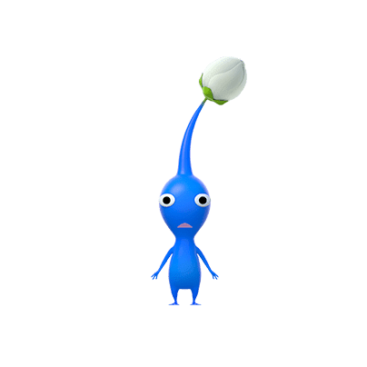

# Daengdong

- 강아지와 함께 떠날 플래너를 작성해보세요!
- 여행 기록을 남기고 추억을 간직하세요
- 특별히 기억하고싶은 기억은 포토카드로!
## Authors
<table>
  <tr>
         <td align="center" width="16%">
            <a href="https://github.com/jamm0316"></a>
            <br />
            <a href="https://github.com/jamm0316">송재명</a>
        </td>
         <td align="center" width="16%">
            <a href="https://github.com/kseenyoung"></a>
            <br />
            <a href="https://github.com/kseenyoung">김신영</a>
        </td>
         <td align="center" width="16%">
            <a href="https://github.com/dmlcksghd"></a>
            <br />
            <a href="https://github.com/dmlcksghd">홍의찬</a>
        </td>
         <td align="center" width="16%">
            <a href="https://github.com/minyoung0302"></a>
            <br />
            <a href="https://github.com/minyoung0302">정민영</a>
        </td>
         <td align="center" width="16%">
            <a href="https://github.com/yuseonghun"></a>
            <br />
            <a href="https://github.com/yuseonghun">유성훈</a>
        </td>
         <td align="center" width="16%">
            <a href="https://github.com/boseungdl"></a>
            <br />
            <a href="https://github.com/boseungdl">한승보</a>
        </td>
    </tr>
</table>

## Tech Stack

**Client:** Javascript, HTML, CSS

**Server:** Java, WebSocket, JSP

**Database:** MySQL 
## Archetecture


## Development Environment


`IDE` Intellij

`JDK` >= 11

`OS` mac, window

## 스크린샷

### 여행기능

### 채팅기능


### 커뮤니티기능

### 회원가입


### 마이페이지 프로필


## 디렉토리 구조

### java
``` text
├── java
│   └── com
│       └── shinhan
│           └── daengdong
│               ├── chat
│               │   ├── controller
│               │   │   └── ChatController.java
│               │   ├── dto
│               │   │   └── ChatMessageDTO.java
│               │   ├── model
│               │   │   ├── ChatParticipant.java
│               │   │   ├── ChatRoom.java
│               │   │   ├── repository
│               │   │   │   └── ChatRoomRepository.java
│               │   │   └── service
│               │   │       └── ChatService.java
│               │   └── websocket
│               │       ├── ChatWebSocketConfig.java
│               │       ├── ChatWebSocketHandler.java
│               │       ├── HttpSessionInterceptor.java
│               │       ├── SessionInfo.java
│               │       └── WebSocketSessionManager.java
│               ├── home
│               │   └── controller
│               │       └── HomeController.java
│               ├── member
│               │   ├── controller
│               │   │   ├── MemberController.java
│               │   │   ├── MemberRestController.java
│               │   │   └── OauthController.java
│               │   ├── dto
│               │   │   ├── FavoritePlaceDTO.java
│               │   │   ├── FollowDTO.java
│               │   │   ├── ImageDTO.java
│               │   │   ├── LikePostsDTO.java
│               │   │   ├── MemberDTO.java
│               │   │   ├── NotificationDTO.java
│               │   │   ├── PetImageDTO.java
│               │   │   ├── RelationshipsDTO.java
│               │   │   └── SignUpDTO.java
│               │   ├── model
│               │   │   ├── repository
│               │   │   │   ├── MemberRepositoryImpl.java
│               │   │   │   └── MemberRepositoryInterface.java
│               │   │   └── service
│               │   │       ├── GoogleOauthService.java
│               │   │       ├── KakaoOauthService.java
│               │   │       ├── MemberServiceImpl.java
│               │   │       └── MemberServiceInterface.java
│               │   └── vo
│               │       ├── MemberPostsVO.java
│               │       └── MemberVO.java
│               ├── notification
│               │   ├── controller
│               │   ├── dto
│               │   ├── model
│               │   │   ├── repository
│               │   │   └── service
│               │   └── vo
│               ├── pet
│               │   └── dto
│               │       └── PetDTO.java
│               ├── photocard
│               │   ├── controller
│               │   ├── dto
│               │   ├── model
│               │   │   ├── repository
│               │   │   └── service
│               │   └── vo
│               ├── place
│               │   ├── controller
│               │   │   └── PlaceController.java
│               │   ├── dto
│               │   │   ├── FavoriteDTO.java
│               │   │   ├── PlaceDTO.java
│               │   │   ├── PlanPlaceDTO.java
│               │   │   └── RegionDTO.java
│               │   ├── model
│               │   │   ├── repository
│               │   │   │   ├── PlaceRepositoryImpl.java
│               │   │   │   └── PlaceRepositoryInterface.java
│               │   │   └── service
│               │   │       ├── PlaceServiceImpl.java
│               │   │       └── PlaceServiceInterface.java
│               │   └── vo
│               ├── plan
│               │   ├── controller
│               │   │   └── PlanController.java
│               │   ├── dto
│               │   │   ├── MemberPlanDTO.java
│               │   │   ├── PlanDTO.java
│               │   │   ├── PlanDetailsDTO.java
│               │   │   └── PlanRelationshipsDTO.java
│               │   ├── model
│               │   │   ├── repository
│               │   │   │   ├── PlanRepositoryImpl.java
│               │   │   │   └── PlanRepositoryInterface.java
│               │   │   └── service
│               │   │       ├── PlanServiceImpl.java
│               │   │       └── PlanServiceInterface.java
│               │   ├── vo
│               │   │   └── PlanVO.java
│               │   └── websoket
│               │       ├── PlanHandshakeInterceptor.java
│               │       └── PlanWebSocketHandler.java
│               ├── post
│               │   ├── controller
│               │   │   ├── PostController.java
│               │   │   └── PostRestController.java
│               │   ├── dto
│               │   │   ├── CommentDTO.java
│               │   │   ├── LikeDTO.java
│               │   │   ├── PostDTO.java
│               │   │   └── PostIMGDTO.java
│               │   ├── model
│               │   │   ├── repository
│               │   │   │   ├── PostRepositoryImpl.java
│               │   │   │   └── PostRepositoryInterface.java
│               │   │   └── service
│               │   │       ├── PostServiceImpl.java
│               │   │       └── PostServiceInterface.java
│               │   └── vo
│               │       ├── CommentVO.java
│               │       ├── LikeVO.java
│               │       └── PostVO.java
│               ├── review
│               │   └── dto
│               │       └── ReviewDTO.java
│               └── util
│                   ├── JacksonConfig.java
│                   ├── WebSocketConfig.java
│                   └── awsS3
│                       ├── S3Config.java
│                       ├── S3Controller.java
│                       └── S3Service.java
├── resources
│   ├── application.properties
│   ├── daengdong.sql
│   ├── dump.sql
│   ├── keystore.p12
│   ├── log4j.xml
│   └── mybatis
│       ├── mappers
│       │   ├── memberMapper.xml
│       │   ├── placeMapper.xml
│       │   ├── planMapper.xml
│       │   └── postMapper.xml
│       └── sqlMapConfig.xml
```

### webapp
``` text
├── WEB-INF
│   ├── root-context.xml
│   ├── root-contextDB.xml
│   ├── servlet-context.xml
│   ├── views
│   │   ├── chat
│   │   │   └── chatFragment.jsp
│   │   ├── common
│   │   │   └── header.jsp
│   │   ├── home.jsp
│   │   ├── member
│   │   │   ├── editNickName.jsp
│   │   │   ├── followerModal.jsp
│   │   │   ├── followingModal.jsp
│   │   │   ├── header.jsp
│   │   │   ├── login.jsp
│   │   │   ├── mypage.jsp
│   │   │   ├── petCreateProfileModal.jsp
│   │   │   ├── petProfileModal.jsp
│   │   │   ├── post.html
│   │   │   ├── profileFragment.jsp
│   │   │   ├── semiCategory
│   │   │   │   ├── photoCard.jsp
│   │   │   │   ├── save
│   │   │   │   │   ├── favoritePlaceFragment.jsp
│   │   │   │   │   ├── likePostsFragment.jsp
│   │   │   │   │   ├── myPostsFragment.jsp
│   │   │   │   │   ├── reviewFragment.jsp
│   │   │   │   │   └── reviewUpdateModal.jsp
│   │   │   │   ├── save.jsp
│   │   │   │   ├── trip
│   │   │   │   │   ├── completeTravelFragment.jsp
│   │   │   │   │   ├── planningFragment.jsp
│   │   │   │   │   └── travelingFragment.jsp
│   │   │   │   └── trip.jsp
│   │   │   ├── signUp.jsp
│   │   │   └── userProfileImageModal.jsp
│   │   ├── photocard
│   │   ├── place
│   │   │   └── searchPlace.jsp
│   │   ├── plan
│   │   │   ├── createPlan.jsp
│   │   │   ├── myPlace.jsp
│   │   │   └── newPlan.jsp
│   │   └── post
│   │       ├── post.jsp
│   │       ├── postCol.jsp
│   │       └── postDetail.jsp
│   └── web.xml
├── css
│   ├── chat
│   │   └── chat.css
│   ├── header.css
│   ├── member
│   │   ├── favoritePlace.css
│   │   ├── followModal.css
│   │   ├── likePosts.css
│   │   ├── login.css
│   │   ├── myPlan.css
│   │   ├── myPost.css
│   │   ├── mypage.css
│   │   └── reviews.css
│   ├── photoCard
│   ├── plan
│   │   ├── searchPlace.css
│   │   └── searchPlceImpl.css
│   ├── post
│   │   ├── post.css
│   │   └── postDetail.css
│   └── signUp.css
├── images
│   ├── banner.jpg
│   ├── community.png
│   ├── header_arlam.png
│   ├── header_community.png
│   ├── header_plan.png
│   ├── header_user.png
│   ├── image 16.png
│   ├── love.png
│   ├── modal.png
│   ├── one-svgrepo-com.svg
│   ├── plan.png
│   └── user.png
├── img
│   ├── Downloads
│   │   ├── day08
│   │   │   └── day08
│   │   │       ├── AbstractTest.java
│   │   │       ├── AppCDInfo.java
│   │   │       ├── Audio.java
│   │   │       ├── CDInfo.java
│   │   │       ├── Changeable.java
│   │   │       ├── Colorable.java
│   │   │       ├── EMailSender.java
│   │   │       ├── Inheritance.java
│   │   │       ├── InterfaceTest.java
│   │   │       ├── Lendable.java
│   │   │       ├── MessageSender.java
│   │   │       ├── Moveable.java
│   │   │       ├── MyBox.java
│   │   │       ├── MyInterface.java
│   │   │       ├── MyInterfaceImpl1.java
│   │   │       ├── MyInterfaceImpl2.java
│   │   │       ├── Prob1.java
│   │   │       ├── RemoteController.java
│   │   │       ├── RemoteController2.java
│   │   │       ├── Resizable.java
│   │   │       ├── SMSSender.java
│   │   │       ├── SeparateVolume.java
│   │   │       ├── Television.java
│   │   │       ├── TranformImpl.java
│   │   │       └── Transformable.java
│   │   ├── movie
│   │   │   └── movie
│   │   │       ├── movieController
│   │   │       │   ├── MovieController.java
│   │   │       │   ├── ReserveController.java
│   │   │       │   └── UserController.java
│   │   │       ├── movieDAO
│   │   │       │   ├── MovieDAO.java
│   │   │       │   ├── ReserveDAO.java
│   │   │       │   └── UserDAO.java
│   │   │       ├── movieDTO
│   │   │       │   ├── MovieDTO.java
│   │   │       │   ├── ReserveDTO.java
│   │   │       │   └── UserDTO.java
│   │   │       ├── movieService
│   │   │       │   ├── MovieService.java
│   │   │       │   ├── ReserveService.java
│   │   │       │   └── UserService.java
│   │   │       └── movieView
│   │   │           ├── MovieView.java
│   │   │           ├── ReserveView.java
│   │   │           └── UserView.java
│   │   ├── pet
│   │   │   ├── PretendardVariable.woff2
│   │   │   ├── images
│   │   │   │   ├── banner.jpg
│   │   │   │   ├── community.png
│   │   │   │   ├── image 16.png
│   │   │   │   ├── love.png
│   │   │   │   ├── one-svgrepo-com.svg
│   │   │   │   ├── plan.png
│   │   │   │   └── user.png
│   │   │   ├── main.css
│   │   │   ├── main2.html
│   │   │   ├── pet.code-workspace
│   │   │   ├── post.css
│   │   │   └── post.html
│   │   └── pro15
│   │       └── pro15
│   │           └── src
│   │               └── sec01
│   │                   ├── ex01
│   │                   │   └── FileUpload.java
│   │                   └── ex02
│   │                       └── FileDownload.java
│   ├── Like.png
│   ├── Likefull.png
│   ├── comment.png
│   ├── daengdong_dog.jpeg
│   ├── empty_like_icon.png
│   ├── empty_star.png
│   ├── fullLike.png
│   ├── kakao_login.png
│   ├── kseenyoungProfile.jpeg
│   ├── left-arrow.png
│   ├── login.png
│   ├── main2.png
│   ├── main3.png
│   ├── main4.png
│   ├── main5.png
│   ├── modal.png
│   ├── more.png
│   ├── plan_create.jpg
│   ├── plan_create2.jpg
│   ├── profile10.jpg
│   ├── profile7.jpg
│   ├── profile8.jpg
│   ├── profile9.jpg
│   ├── right-arrow.png
│   ├── shorlock.jpeg
│   └── star.png
├── index.jsp
├── js
│   ├── addCompanion.js
│   ├── chat
│   │   ├── chat.js
│   │   └── planChat.js
│   ├── finalSend.js
│   ├── main.js
│   ├── member
│   │   └── mypage.js
│   ├── photoCard
│   ├── planWebSocket.js
│   ├── post
│   │   ├── like.js
│   │   └── postImageUpload.js
│   ├── searchPlace_app.js
│   ├── signUp.js
│   ├── uploadFile.js
│   └── websocket.js
├── main2.jsp
├── style2.css
└── upload
    ├── cat1_1736831296666.jpg
    ├── cat2_1736831263308.jpg
    ├── cat3_1736831263307.jpg
    └── cat4_1736831263306.jpg
```
## API Reference

### Auth

#### login page

```http
  GET /auth/login.do
```

#### login

```http
  POST /auth/login.do
```

| Parameter | Type     | Description                       |
| :-------- | :------- | :-------------------------------- |
| `member_id` | `string` | **Required**. Id of member |
| `password`  | `string` | **Required**. password of member |


### Room

#### room page

```http
  GET /room/rooms.do
```

### Chat

#### chat page

```http
  GET /chat/chat.do?chatId
```

| Parameter | Type     | Description                       |
| :-------- | :------- | :-------------------------------- |
| `chatId` | `int` | **Required**. chatId for enter chat |


## Run Locally

project Clone

```bash
  git clone https://github.com/kseenyoung/DaengDong
```

Move to project directory

```bash
  cd DaengDong
```

Start the server

```bash
  npm run start
```


## Screenshots


